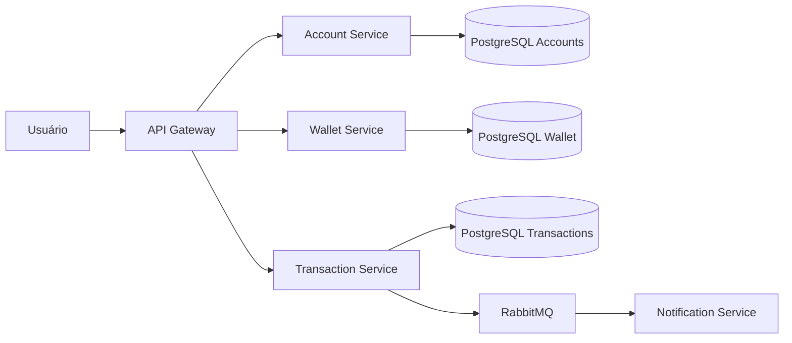

# Fintech Wallet

## Visão Executiva

A Fintech Wallet é uma plataforma financeira digital desenvolvida para gerenciamento de contas, consulta de saldo, realização de transferências e acompanhamento de transações financeiras.

Na Fase 2 do projeto foi adotada a Arquitetura Hexagonal (Ports & Adapters) para garantir o isolamento das regras de negócio. Na Fase 3, a arquitetura evoluiu para um modelo baseado em Microsserviços e Computação em Nuvem, visando escalabilidade, resiliência e alta disponibilidade.

---

## Diagrama C4 - Containers



---

## ADRs

- [ADR 0001 - Estratégia de Nuvem](docs/adrs/0001-estrategia-nuvem.md)
- [ADR 0002 - Padrão de Resiliência](docs/adrs/0002-padrao-resiliencia.md)
- [ADR 0003 - Modelo de Comunicação](docs/adrs/0003-modelo-comunicacao.md)

---

## SAD

- [SAD Fase 3](docs/sad/sad-fase3.md)

---

## Tecnologias

- Java Spring Boot
- PostgreSQL
- Docker
- RabbitMQ
- API Gateway
- REST APIs

---

## Execução do Projeto

```bash
docker-compose up -d
```
